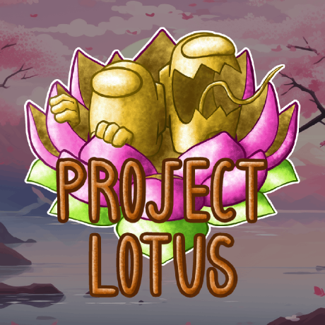

# AmongUsVersion
These are [Among Us](https://store.steampowered.com/app/945360/Among_Us)'s version.
If you want to download mods, you can use these.
Version V2024.6.18 or above.(on [Steam](https://store.steampowered.com/?l=tchinese))
If you want to download other versions, please go to depotdownloader, but there are very complex.

1.Download the archives we [release](https://github.com/JTPR5722/AmongUsVersion/releases)(Among Us Vxxxx.xx.xx.zip).                                                                                                               
2.Then find your [Among Us file](https://github.com/JTPR5722/AmongUsVersion/tree/AmongUsVersion/Among%20Us%20file) original folder, copy it, and rename it to an easy-to-understand name, like "Among Us V2024.6.18".                                              
3.Delete the original `Among Us_Data` and `GameAssembly` and paste the downloaded ones.                                                                                           
4.Done!

# Among Us Mods:

## [The Other Rules](https://github.com/TheOtherRolesAU/TheOtherRoles/releases)       

## [Town Of Host-Enhanced](https://github.com/EnhancedNetwork/TownofHost-Enhanced/releases)

## [Endless Host Rules](https://github.com/Gurge44/EndlessHostRoles/releases)

## [Town Of Us-R](https://github.com/eDonnes124/Town-Of-Us-R?tab=readme-ov-file#releases)

## [Las Monjas](https://github.com/KiraYamato94/LasMonjas/releases)

## [Extreme Rules](https://github.com/yukieiji/ExtremeRoles/releases)

## [Super New Rules](https://github.com/SuperNewRoles/SuperNewRoles/releases)

## [Stellar Rules](https://github.com/Mr-Fluuff/StellarRolesAU/releases)

## [More Gamemodes](https://github.com/Rabek009/MoreGamemodes/releases)

## [Town Of New Epic_Xtreme](https://github.com/XtremeWave/TownOfNewEpic_Xtreme/releases)

## [The Other Us](https://github.com/SpexGH/TheOtherUs/releases/)

## [Town Of Host](https://github.com/tukasa0001/TownOfHost/releases)

## [All The Rules](https://github.com/Zeo666/AllTheRoles/releases/)                              

## [Among Us_Challenger](https://store.steampowered.com/app/2160150/AmongUs_Challenger/)

## [SKELD.NET](https://skeld.net/)                                                                    

## [Nebula](https://github.com/Dolly1016/Nebula/releases)                        
### [on the ship](https://github.com/Dolly1016/Nebula/releases)                                                                                                                               

## [Town Of Us-Releases](https://github.com/AlchlcDvl/TownOfUsReworked/releases)

---------------------------------------------------------------------
# Not released yet :

## [Lotus_Continued](https://github.com/Lotus-AU/LotusContinued/releases)

## https://github.com/Lotus-AU/VentFramework-Continued

## https://github.com/haoming37/GMH/releases

## https://github.com/ImaMapleTree/simply-cli/releases

## https://github.com/ImaMapleTree/TOURHatAddon/releases 

## The Better Rules

---------------------------------------------------------------------
# Maps:

## [Submerged](https://github.com/SubmergedAmongUs/Submerged/releases)                 

## [Level Imposter](https://levelimposter.net/)                                           

--------------------------------------------------------------------- 

# Others

## [Better Crewlink](https://github.com/OhMyGuus/BetterCrewlink)

## [Crewlink](https://github.com/ottomated/CrewLink)

## [Among Us Replay In Window](https://github.com/sawa90/AmongUsReplayInWindow)

## [Mod Manager](https://github.com/MatuxGG/ModManager)

## [Level Imposter](https://github.com/DigiWorm0/LevelImposter-Editor)

https://github.com/MyDragonBreath/AmongUs.MultiClientInstancing 

## [Among Us Wiki](https://among-us.fandom.com/wiki/Mods)                                                                                                                                 

# 
